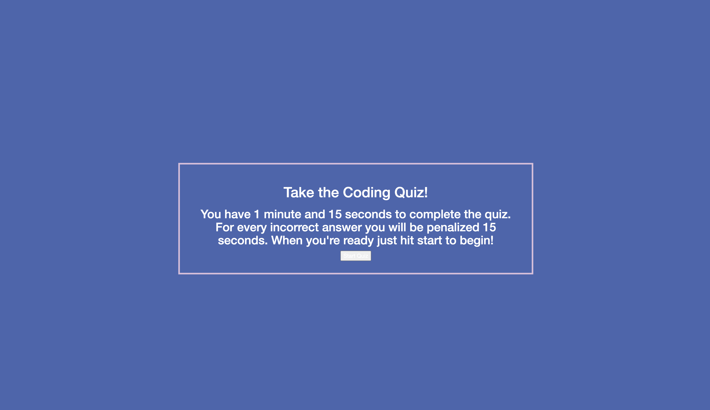

# Code Quiz

## Description 

This app is a simple Quiz generator. When the user is ready, they are prompted to press the start button which begins the Quiz. The user is given 1 minute and 15 seconds
to complete the 5 question quiz. When they have completed the quiz, the user is shown their score based on how many questions they answered correctly. Should the user exceed the 1 minute and 15 second mark, the quiz will be terminated and their current score will be shown. 

After the quiz has been finished, the user will be prompted to enter their initials. Once a valid set of initials is entered, the score and user's initials will be stored in a 
High Score tab. 

## Usage

To begin the quiz the user must press the "Start Quiz" button. This will reveal the first question. Each possible answer is a button and allows the user to press on whichever they find to be correct. Depending on if the user answered correctly, their current score will be updated. 

# JavaQuiz
